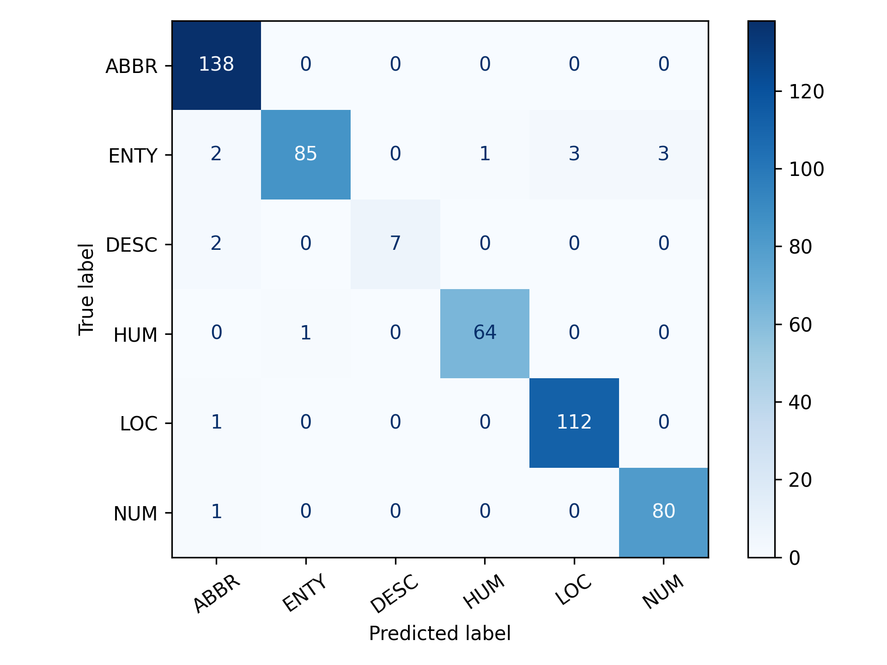

# TREC Question Classifier

This repository contains a complete pipeline for fine-tuning DistilBERT on the TREC Question Classification dataset. The goal is to classify questions into six coarse categories: **ABBR** (abbreviation), **ENTY** (entity), **DESC** (description), **HUM** (human), **LOC** (location), and **NUM** (numeric).

---

## Project Structure

```
intern-ML-NLP/                  # Project root
├─ models/                      # placeholders for model artifacts
│    ├─ .gitkeep                # keep models/ in Git
│    └─ distilbert-trec-tf/     # fine-tuned model files
│         ├─ trained model/     # saved_model.pb, variables/
│         │    └─ .gitkeep      # placeholder
│         └─ transformer/       # tokenizer files
│              └─ .gitkeep      # placeholder
├─ reports/                     # evaluation outputs
│    └─ metrics_tf.png          # confusion matrix plot
├─ src/                         # source code scripts
│    ├─ data.py                 # dataset loading & preprocessing
│    ├─ utils.py                # logging & plotting helpers
│    ├─ train_tf.py             # TensorFlow training script
│    └─ eval_tf.py              # TF evaluation & confusion matrix
├─ .gitignore                   # ignore models/, caches, envs
├─ requirements.txt             # Python dependencies
├─ submission.md                # project approach & learnings
└─ README.md                    # this file
```

---

## Getting Started

### 1. Clone the repository

```bash
git clone https://github.com/<your-username>/trec-question-classifier.git
cd trec-question-classifier
```

### 2. Set up the environment

```bash
python -m venv venv
# Windows
env\Scripts\activate
# macOS/Linux
source venv/bin/activate
pip install --upgrade pip
pip install -r requirements.txt
```

### 3. Train the model

```bash
# From project root
python -m src.train_tf --epochs 3
```

* Model and tokenizer artifacts will be saved under `models/distilbert-trec-tf/`.

### 4. Evaluate the model

```bash
python -m src.eval_tf --ckpt models/distilbert-trec-tf
```

* Prints a classification report (precision, recall, F1)
* Saves a confusion matrix to `reports/metrics_tf.png`

---

## Results

* **Validation Accuracy:** \~97.2%
* **Macro F1 Score:** 0.96
* **Weighted F1 Score:** 0.97



---

## Next Steps & Ideas

* **Data augmentation** for under-represented classes (e.g., back-translation for DESC)
* **Multilingual fine-tuning** using XLM-RoBERTa for cross-lingual transfer
* **Model compression** or distillation for faster inference on edge devices

---

## References

* Li, X., & Roth, D. (2002). Learning Question Classifiers. COLING.
* Hugging Face Transformers & Datasets documentation
* TensorFlow 2.x and Keras guides
